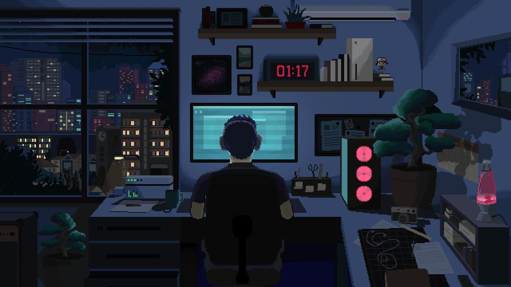
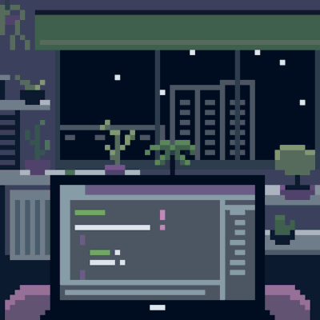
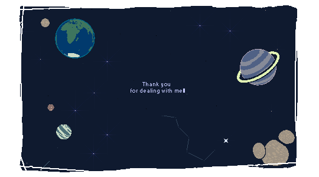

  

<h2 align="center">Hi there 👋, I'm Akhand RAJ</h1>
<h3 align="center">A passionate Python Developer from India</h3>

I'm a passionate self-taught programmer and tech enthusiast, with a love for coding and continuous learning. Despite starting my tech journey early, I've built a strong foundation in various programming languages and technologies, including Python, C++. I believe in practical learning, and most of my projects reflect a balance between creativity and solving real-world problems.

- 🔭 I’m currently working on **[PyStreamSaver Pc App](https://github.com/Akkiraj1234/PyStreamSaver)**

- 🌱 I’m currently learning **DevOps**

- 💬 Ask me about **Python , Software Devlopment**

- 📫 How to reach me **[akhandr153@gmail.com](mailto:akhandr153@gmail.com)**

- ⚡ Fun fact **I am into sketching, Archary and chess**

### Connect with me

## info about me

## 🔧 Technologies & Skills

| **Category**      | **Skills**                      | **Currently Learning** |
|-------------------|---------------------------------|------------------------|
| **Languages**     | Python, C++, JavaScript, HTML, CSS | React                  |
| **Game Development** | Godot, Unity (in progress)     |                        |
| **Web Development** | Flask, Django                 | React                  |
| **Databases**     | MySQL, SQLite                   |                        |
| **Tools & Platforms** | Git, Arduino, Raspberry Pi   |                        |
| **Mobile Development** | Android (in progress)       |                        |
| **Design**        | Realistic Sketching, Game Character Design |               |

---

## 💡 Goals

- Secure a high-paying job as a software engineer.
- Build my own software development company.
- Travel the world and experience different cultures 🌏.
- Pursue a Master's degree (MCA) and settle in Norway.

  

