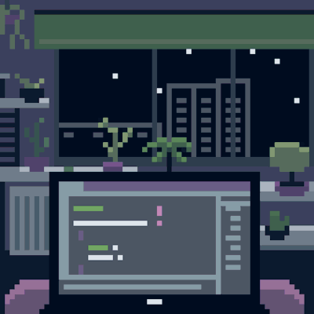
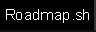
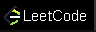

  <!-- Header Image -->
  

  <!-- Introduction -->
  <h2 style="margin-top: 20px;">
    Hi there 👋, I'm Akhand RAJ
  </h2>
  <h3>A passionate Python Developer from India</h3>
  
  
  
  

    I'm a passionate self-taught programmer and tech enthusiast with a love for coding and continuous learning. Despite starting my tech journey early, I've built a strong foundation in various programming languages and technologies (Python, C++, and more). My projects strike a balance between creativity and solving real-world problems.
  

  
  <ul style="list-style: none; padding: 0;">
    <li>🔭 I’m currently working on <a href="https://github.com/Akkiraj1234/PyStreamSaver" style="color: #0ff;">PyStreamSaver Pc App</a></li>
    <li>🌱 I’m currently learning DevOps</li>
    <li>💬 Ask me about Python, Software Development</li>
    <li>📫 Reach me at <a href="mailto:akhandr153@gmail.com" style="color: #0ff;">akhandr153@gmail.com</a></li>
    <li>⚡ Fun fact: I am into sketching, archery, and chess</li>
  </ul>
  
  <!-- Social Links -->
  <h3>Connect with me</h3>
  

    
    
    
    
    
    
  

  
  <!-- Stats & Info -->
  <h3>Info About Me</h3>
  

    
  

  

    
  

  

    
  

  

    
  

  
  <!-- Technologies & Skills -->
  <h3>🔧 Technologies & Skills</h3>
  <table style="width: 90%; margin: auto; border-collapse: collapse;">
    <tr style="background: rgba(0,255,255,0.1);">
      <th style="padding: 8px; border: 1px solid #0ff;">Category</th>
      <th style="padding: 8px; border: 1px solid #0ff;">Skills</th>
      <th style="padding: 8px; border: 1px solid #0ff;">Currently Learning</th>
    </tr>
    <tr style="background: rgba(255,0,255,0.1);">
      <td style="padding: 8px; border: 1px solid #0ff;">Languages</td>
      <td style="padding: 8px; border: 1px solid #0ff;">Python, C++, JavaScript</td>
      <td style="padding: 8px; border: 1px solid #0ff;">Rust, Typescript</td>
    </tr>
    <tr style="background: rgba(0,255,255,0.1);">
      <td style="padding: 8px; border: 1px solid #0ff;">Web Development</td>
      <td style="padding: 8px; border: 1px solid #0ff;">Flask, Django, HTML, CSS</td>
      <td style="padding: 8px; border: 1px solid #0ff;">React, Node.js, Express.js, Astro</td>
    </tr>
    <tr style="background: rgba(255,0,255,0.1);">
      <td style="padding: 8px; border: 1px solid #0ff;">Databases</td>
      <td style="padding: 8px; border: 1px solid #0ff;">MySQL, SQLite, JSON</td>
      <td style="padding: 8px; border: 1px solid #0ff;">PostgreSQL, Redis</td>
    </tr>
    <tr style="background: rgba(0,255,255,0.1);">
      <td style="padding: 8px; border: 1px solid #0ff;">GUI</td>
      <td style="padding: 8px; border: 1px solid #0ff;">PyQt, Qt, Tkinter, ttk...</td>
      <td style="padding: 8px; border: 1px solid #0ff;">OpenGL</td>
    </tr>
    <tr style="background: rgba(255,0,255,0.1);">
      <td style="padding: 8px; border: 1px solid #0ff;">Networking</td>
      <td style="padding: 8px; border: 1px solid #0ff;">Socket, Request, Http.io</td>
      <td style="padding: 8px; border: 1px solid #0ff;">boost.io, Tornado, FastAPI, RestAPI</td>
    </tr>
    <tr style="background: rgba(0,255,255,0.1);">
      <td style="padding: 8px; border: 1px solid #0ff;">Tools & Platforms</td>
      <td style="padding: 8px; border: 1px solid #0ff;">Git, Github</td>
      <td style="padding: 8px; border: 1px solid #0ff;">Npm, DevOps, AWS, Security</td>
    </tr>
    <tr style="background: rgba(255,0,255,0.1);">
      <td style="padding: 8px; border: 1px solid #0ff;">Other</td>
      <td style="padding: 8px; border: 1px solid #0ff;"></td>
      <td style="padding: 8px; border: 1px solid #0ff;">CMake, Ninja</td>
    </tr>
  </table>
  
  

  
  <!-- Future Projects -->
  <h3>Future Projects I Will Work On</h3>
  <ol style="text-align: left; padding: 0 20px;">
    <li>
      <strong>Screen Time Tracker</strong>: A C++ based GUI application to track screen time across applications. Utilizes the Windows API (or Linux daemon processes), built using PyQt, and uses SQLite for data storage.
    </li>
    <li>
      <strong>Advanced Task Manager</strong>: An app that integrates with Google Tasks and Microsoft To Do, featuring automatic scheduling based on weather and sleep patterns. (Technologies: C++, Python, Google Tasks API, Microsoft To Do API, SQLite, and more.)
    </li>
    <li>
      <strong>Web-Based Task Tracker</strong>: A web app mirroring desktop task management features. Built with React, Django, PostgreSQL, Tailwind CSS, and Redis for caching.
    </li>
  </ol>
  
  

  
  <!-- Goals -->
  <h3>💡 Goals</h3>
  <ul style="text-align: left; padding: 0 20px;">
    <li>Secure a high-paying job as a software engineer.</li>
    <li>Build my own software development company.</li>
    <li>Travel the world and experience different cultures 🌏.</li>
    <li>Stay updated with the latest technologies.</li>
    <li>Find someone who can support my mental health and settle down.</li>
  </ul>
  
  <!-- Footer GIF -->
  

