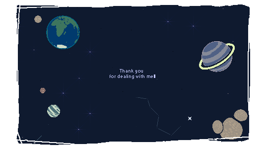

<h2 style="margin-top: 20px;" align="center"> hey i am akhand raj ^^</h2>

<h3 align="center">Software Developer • Backend Engineering • Software Architecture</h3>

Software developer focused on backend engineering, software architecture, and building modular systems. I enjoy understanding how systems work, solving architectural problems, and turning complex ideas into clean, maintainable software.

> I primarily work with Python, C, C++, JavaScript, and SQL. I learn primarily by building real software, experimenting with different approaches, and exploring the trade-offs behind technical decisions.

- 🔭 Currently building <a href="https://github.com/Akkiraj1234/shipyard">Shipyard</a>, an open-source project lifecycle companion. 
- 🛠️ I enjoy solving real-world problems and building practical tools that can be useful to other developers. 
- 🌐 Learn more about my work and projects at <a href="https://akhand.dev">akhand.dev</a>. 
- 📫 Reach me at <a href="mailto:akhandraj402@gmail.com">akhandraj402@gmail.com</a>. 
- 🎨 Outside of software, I'm into sketching and archery.

  
  
  
  
  

    

    

    

### 🔮 Future Projects

1. **Simple JSON Diff**: A lightweight JSON diff and synchronization   system that tracks changes through versioned references instead of duplicating full state history, enabling memory-efficient incremental updates over polling and SSE.

2. **LeetCode Solver**: A personal problem-solving and review system inspired by spaced repetition. It helps decide what LeetCode problems to solve each day based on previously solved problems, topics, difficulty, and review history.
  

  

